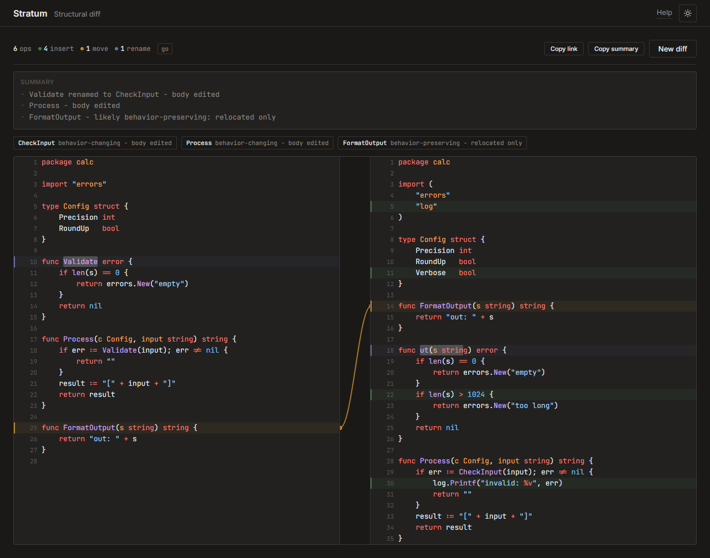
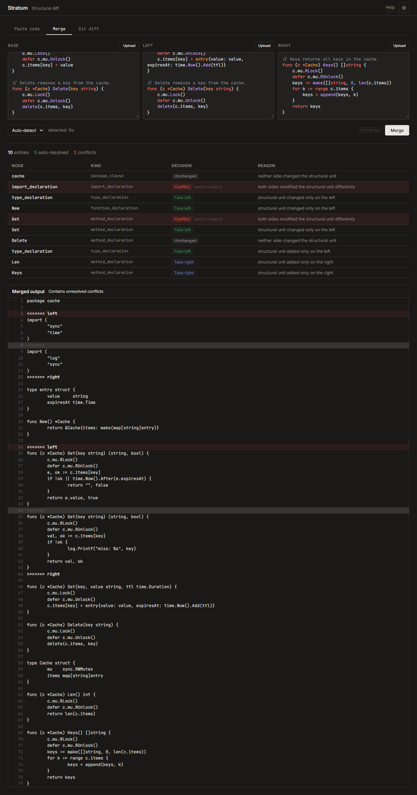
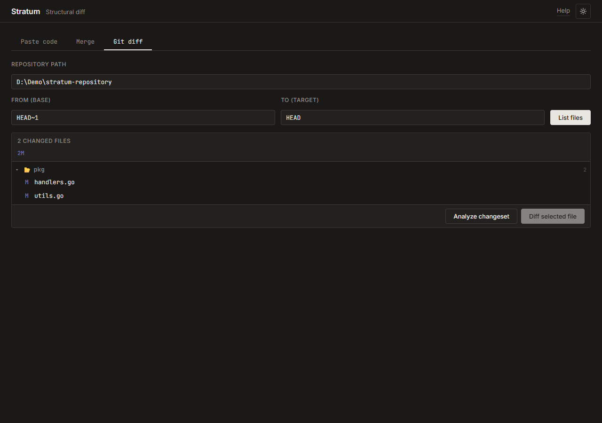
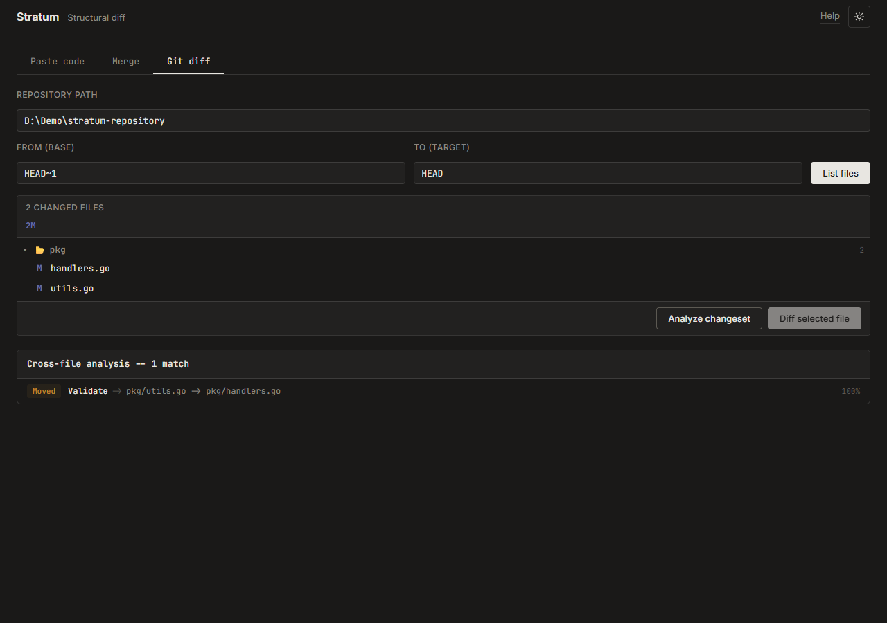
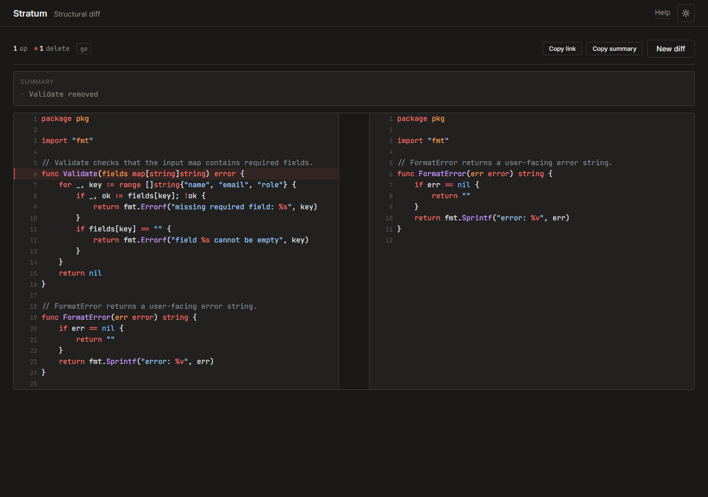

# Stratum

[](https://github.com/shreemangalam/stratum/actions/workflows/ci.yml)

Structural diff, merge, and cross-file analysis tool. Parses source
files into ASTs, matches nodes across versions, and produces edit
scripts that name moves, renames, and semantic changes rather than
line changes.



## What it does

Line-based diffs show you *what lines changed*. Stratum shows you *what
happened*: a function moved, a variable was renamed, a condition was
inverted. It parses both versions of a file into syntax trees, matches
nodes across them, and generates an edit script of structural operations.

The diff view above shows `FormatOutput` moved (amber arrow), `Validate`
renamed to `CheckInput` with a body edit, a struct field inserted, and
semantic verdicts classifying each change as behavior-preserving or
behavior-changing.

> [Watch the structural diff workflow (WebM)](docs/screenshots/structural-diff-demo.webm)

Beyond single-file diffs, Stratum provides:

- **Three-way merge** -- given a common ancestor and two
  branches, produces a per-node merge plan with structural conflict
  classification (modify-modify, delete-modify, rename-rename, add-add)
  and synthesized merged output with git-style conflict markers.
- **Cross-file move detection** -- when analyzing a git changeset,
  correlates deleted nodes in one file with inserted nodes in another to
  detect cross-file moves, renames, and rename-moves.

### Three-way merge



The merge view shows per-node decisions: which side's changes are taken,
which conflict, and the synthesized merged output with conflict markers.

> [Watch the merge workflow (WebM)](docs/screenshots/merge-demo.webm)

### Git changeset with cross-file detection



Point at a local git repository and two refs.  Stratum lists changed files
with status badges, then optionally runs cross-file analysis:



The cross-file panel detects functions that moved between files, showing
source and destination paths with similarity scores.



Each file can also be diffed individually, producing the same structural
annotations (moves, renames, semantic verdicts) as the paste-code mode.

> [Watch the changeset workflow (WebM)](docs/screenshots/changeset-demo.webm)

## How it works

1. **Parse** both file versions into structural trees using language-specific
   parsers. Go gets a full AST via the stdlib parser; XSLT/XML uses a
   structure-aware XML parser; JS, TS, Python, Java, C, and C++ use
   heuristic structural scanners that identify declarations without a
   full AST.
2. **Match** nodes across trees in three phases: top-down hash matching
   for identical subtrees, bottom-up dice matching for restructured
   subtrees, and residual optimal alignment for small ambiguous regions.
3. **Generate** an edit script classifying each change as an insert,
   delete, move, rename, update, or alignment change.
4. **Merge** (three-way): match base-to-left and base-to-right, then
   iterate structural units to produce per-node merge decisions and
   synthesize the merged file content (auto-resolved text or conflict
   markers).
5. **Cross-file analysis**: collect deleted and inserted nodes across
   all files in a changeset, match by content hash (exact moves),
   label+similarity (edited moves), and kind+similarity (rename-moves).
6. **Render** in the web UI with scroll-synced panes, syntax highlighting,
   diff annotations, SVG move arrows, merge decision tables, and
   cross-file relationship panels.

When the optimal-alignment cost estimate exceeds a configurable budget,
Stratum leaves the remaining nodes as insertions/deletions and marks the
region approximate instead of attempting an expensive alignment.

## Architecture

```
server/           Go backend
  cmd/api/        Entry point
  internal/
    core/         Algorithm (pure, no I/O)
    parse/        Language parsers and plugin registry
    cache/        Content-addressed cache
    jobs/         Async job execution
    store/        Postgres persistence
    http/         Handlers, middleware
  migrations/     SQL migrations
web/              Next.js frontend
contract/         OpenAPI spec (source of truth for wire format)
docs/             Design documents, ADRs, and evidence
```

The `internal/core/` boundary is inviolable: the core package contains
zero I/O, database, or HTTP imports.  This keeps the algorithm testable
with fast unit tests and benchmarks while the HTTP and store layers handle
infrastructure concerns.

## Setup

Prerequisites: Go 1.25+, Node.js 24+, Docker.

```bash
make setup
```

Start development:

```bash
cd server && go run ./cmd/api    # in one terminal
cd web && npm run dev             # in another terminal
```

Run tests:

```bash
make test
```

See [Verification and Evidence](docs/testing.md) for the full test matrix,
latest results, representative benchmarks, and the limits of the current
evidence.

## Docker deployment

Run the full stack (Postgres + API + frontend) with Docker Compose:

```bash
docker compose --profile full up --build
```

Without `--profile full`, only Postgres starts (for local development).

The API reads `ALLOWED_ORIGINS` to restrict CORS (comma-separated origins,
or `*` for any). It defaults to `http://localhost:3000`. Local Git endpoints
are opt-in through `GIT_ENABLED=true`; the Compose development stack enables
them, while a production deployment should leave them disabled.

Individual images:

```bash
docker build -t stratum-api ./server
docker build -t stratum-web ./web
```

## Test coverage

| Layer | Count | What it proves |
|---|---:|---|
| Go unit + integration tests | 191 | Core algorithms, store persistence, HTTP handlers, merge, cross-file detection |
| Fuzz targets | 10 | Parser and matcher invariants under malformed input |
| Benchmarks | 15 | Performance characteristics and allocation profiles |
| Golden corpus | 21 | Expected operations across 8 languages (C, C++, Go, Java, JS, Python, TS, XSLT) |
| Playwright E2E | 25 | Browser smoke tests, merge form, full-stack end-to-end |
| Static analysis | -- | golangci-lint (0 issues), TypeScript (0 errors), Biome (0 issues) |

## Language fidelity

| Language     | Parser type                  | Fidelity                                     |
|-------------|------------------------------|----------------------------------------------|
| Go          | Full AST (go/parser stdlib)  | Every statement and expression is a node     |
| XSLT / XML  | Structure-aware XML parser   | Elements, attributes, templates, text nodes  |
| JavaScript  | Heuristic structural scanner | Functions, classes, methods, imports, exports |
| TypeScript  | Heuristic structural scanner | Functions, classes, interfaces, types, imports|
| Python      | Heuristic structural scanner | Functions, classes, methods, imports          |
| Java        | Heuristic structural scanner | Classes, interfaces, enums, methods, imports  |
| C / C++     | Heuristic structural scanner | Functions, structs, enums, typedefs, macros  |

Full AST parsers produce a complete syntax tree. Structural scanners
identify top-level declarations for accurate move and rename detection
but treat function bodies as opaque text. Unsupported languages fall
back to line-by-line comparison with trivial-line filtering.

## Shipped features

- **v1**: Core structural diff with web UI, async job execution,
  content-addressed caching, bounded computation with graceful degradation.
- **v2**: Function-level semantic verdicts (behavior-preserving,
  behavior-changing, indeterminate). For Go, lightweight def/use analysis
  distinguishes independent from dependent statement reorderings.
- **v3**: Three-way structural merge with per-node conflict classification
  and merged source generation. Cross-file rename and move detection across
  git changesets.

## Known limitations

- **Structural scanners are not full parsers.** JS/TS/Python/Java/C/C++
  scanners identify declarations by keyword patterns. Deeply nested or
  unusual syntax may be missed or misclassified.
- **Semantic verdicts are conservative heuristics, not proof.** Go
  statement reorderings receive an additional bounded def/use analysis.
  Other Go changes and scanner-backed languages still rely on edit-script
  shape and can be misclassified.
- **Body limit is per request, not per file.** The server enforces a 1 MB
  limit on the entire JSON request body.
- **Git mode accesses the local filesystem.** When explicitly enabled,
  the Git diff tab runs `git show` and `git diff` against local repositories.
  Keep `GIT_ENABLED=false` on a public deployment.
- **Single-machine, single-worker.** The worker pool is not distributed.
  A production deployment would need horizontal scaling and job sharding.
- **No independently labeled ground truth.** The golden corpus tracks
  regression but doesn't yet have expert-labeled matchings for precision/recall.

## Remaining

Labeled public benchmark with precision/recall for move detection.
Additional language plugins driven by demand.

## License

MIT
